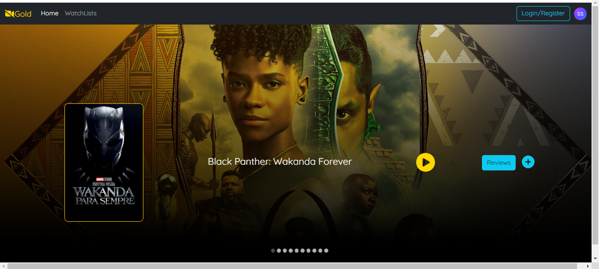

# Movie App Frontend

Welcome to the React Movie App, a web application that allows users to browse, watch trailers, and discover information about movies.



## Features

- Browse a vast collection of movies.
- Search for movies by title, genre, or release year.
- View detailed information about each movie.
- Save your favorite movies to your profile.
- User-friendly and responsive design for various devices.

## Technologies Used

- React: A JavaScript library for building user interfaces.
- HTML and CSS: Markup and styling languages for creating frontend components.

## Getting Started

To run the React Movie App locally, follow these steps:

1. Clone this repository to your local machine:

   ```bash
   git clone https://github.com/your-username/react-movie-app.git
2. Navigate to the project directory:

  ```bash
  cd react-movie-app
 ```

3. Install project dependencies:

  ```bash
  npm install
```

4. Start the development server:

  ```bash
  npm start
 ```

5. Open the application in your web browser at http://localhost:3000.

## Usage
- Browse and watch trailers for movies by using the play icon.
- Click on a movie to view its details.
- Save your favorite movies by clicking the "Add to Favorites" button.

## Customization
You can customize the React Movie App by modifying the components, styles, and functionalities in the source code to suit your specific requirements. Feel free to add new features or enhance existing ones.


